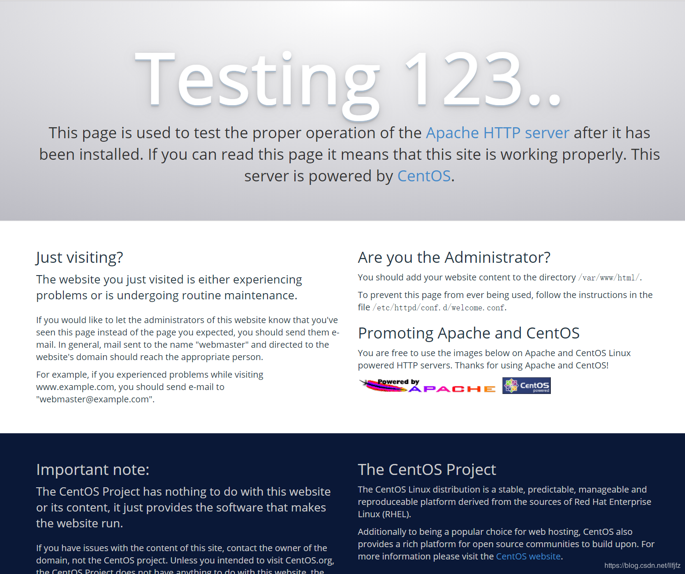
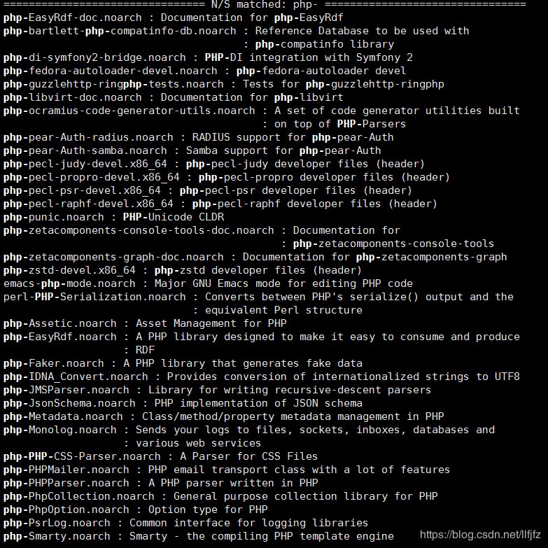
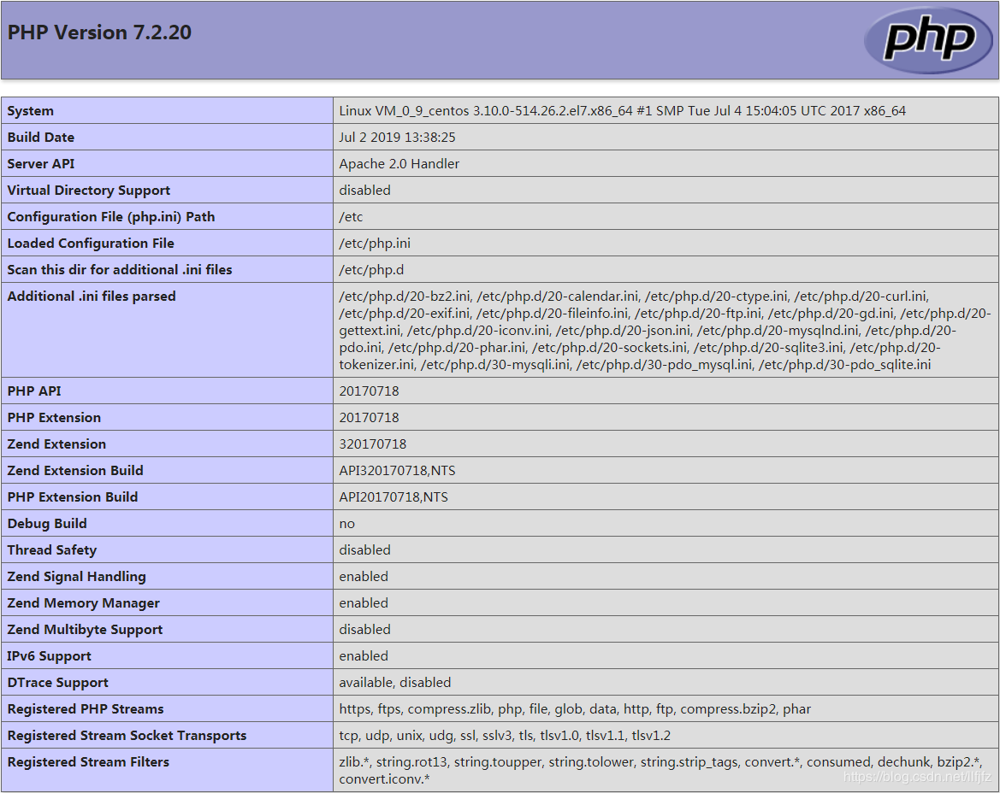
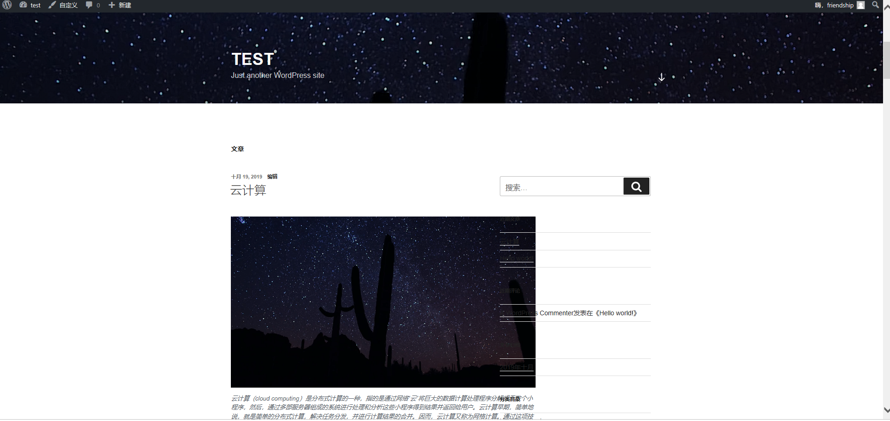

                                                                 实验二个人网站的搭建过程

- 云操作系统：CentOS 7.2 64位；
- HTTP服务器：Apache Web 服务器；
- 数据库：MySQL；
- 建站工具：WordPress（基于PHP）

1.安装Apache Web服务器

2.安装MySQL

3.安装PHP

安装PHP模块

4.测试PHP

5.安装WordPress以及完成相关配置

(1)为WordPress创建一个MySQL数据库

(2)安装WordPress

(3)配置WordPress

(4)通过Web界面进一步配置WordPress

