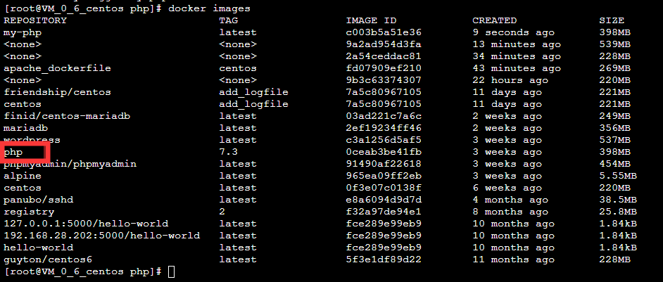

1、在CentOS环境下安装Docker

验证docker是否安装成功并启动，得到如下输出


还可以查看一下Docker的版本信息


2、加载Docker的CentOS镜像


提交新的镜像并推送至Docker Hub


3、拉取CentOS镜像后运行一个容器实例


在容器实例中安装WordPress并制作成镜像，在8081端口映射公网IP：106.54.15.12

访问时在公网IP地址后面加：8081  即可访问，一下为截图


​                                                                 dockerfile文件的编写


​                                                                安装Apache Web服务器


​                                                                安装PHP



​                                                                                构建wordpress


​                                                          安装MySQL


mysql的Dockerfile:

FROM centos:latest 
MAINTAINER BruceJin for mysql 
RUN yum install -y mariadb mariadb-server mariadb-client mariadb-devel \
WORKDIR /root
ADD setup.sql /root/setup.sql
ADD setup.sh /root/setup.sh
ADD startup.sh /root/start.sh
RUN chmod +x /root/*.sh \
&& /root/setup.sh
EXPOSE 3306
CMD /root/start.sh


php的Dockerfile:

FROM centos:latest 
MAINTAINER Bruce for WordPress 
RUN groupadd -g 1001 nginx && useradd -u 900 nginx -g nginx -s /sbin/nologin \
&& yum install -y php-fpm php-mysql && yum clean all 
CMD ["php-fpm","-F"]


nginx 的 Dockerfile:

```
#lnmp centos 6.0
from centos:centos6
MAINTAINER xiaoluo <xiaoluo@``test``.com>
ENV APP_DIR ``/web
add nginx-1.11.10 ``/nginx-1``.11.10
RUN yum -y groupinstall ``"Development Tools"` `"Server Platform Deveopment"
RUN yum -y ``install` `openssl-devel pcre-devel
RUN ``useradd` `nginx -s ``/sbin/nologin
RUN ``cd` `/nginx-1``.11.10 && .``/configure` `--prefix=``/usr/local/nginx` `--user=nginx --group=nginx --with-http_ssl_module --with-http_flv_module --with-http_stub_status_module --with-http_gzip_static_module  --with-pcre && ``make` `&& ``make` `install
RUN ``mkdir` `/usr/local/nginx/conf/vhosts
RUN ``mkdir` `/var/log/nginx
ADD nginx.conf ``/usr/local/nginx/conf/nginx``.conf
ADD nginx_default.conf ``/usr/local/nginx/conf/vhosts/default``.conf
EXPOSE 80
CMD [``"/usr/local/nginx/sbin/nginx"``]
```

wordpress的Dockerfile:

FROM mysql:5.7
ENV MYSQL_ALLOW_EMPTY_PASSWORD yes
WORKDIR /www
ADD ./mysql_init.sql /www/mysql_init.sql
RUN service mysql start \
&& sleep 5 \
&& mysql < /www/mysql_init.sql \
&& service mysql stop
RUN apt-get -q update \
&& apt-get -q -y install php7.0 php7.0-fpm php7.0-mysql \
&& apt-get -q -y install nginx \
&& apt-get -q -y install wget \
&& wget -q http://cn.wordpress.org/wordpress-4.7.4-zh_CN.tar.gz \
&& tar -xf wordpress-4.7.4-zh_CN.tar.gz \
&& chown -R www-data wordpress \
&& apt-get clean \
&& apt-get purge -y --auto-remove wget \
&& echo "" >> ~/.bashrc \
&& echo "service mysql start" >> ~/.bashrc \
&& echo "service php7.0-fpm start" >> ~/.bashrc \
&& echo "service nginx start" >> ~/.bashrc
ADD ./default /etc/nginx/sites-available/default
ADD ./db_init.sql /www/
WORKDIR /root
EXPOSE 80
ENTRYPOINT ["/bin/bash"]

